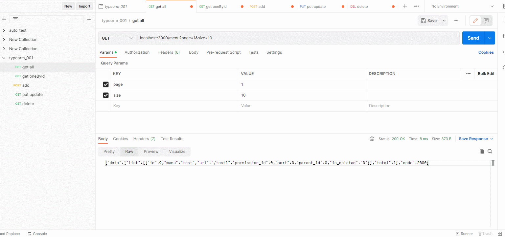
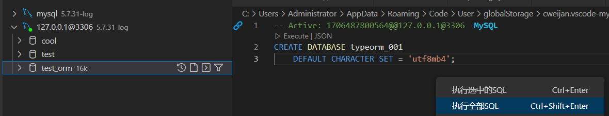
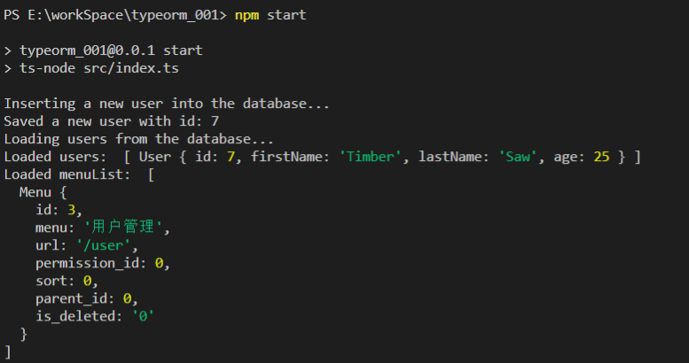

## 一、初始化typeorm项目

1. **执行如下命令创建项目**

`npx typeorm init --name typeorm_001 --database mysql`

2. **手动创建数据库**

3. **修改 data-source.ts 相关配置**
```js
import "reflect-metadata"
import { DataSource } from "typeorm"
import { User } from "./entity/User"

export const AppDataSource = new DataSource({
    type: "mysql",
    host: "localhost",
    port: 3306,
    username: "root",
    password: "123456",
    database: "typeorm_001",
    synchronize: true,
    logging: false,
    entities: [User],
    migrations: [],
    subscribers: [],
})
```


4. **执行 npm start 输出如下**
```bash
PS E:\workSpace\typeorm_001> npm start

> typeorm_001@0.0.1 start
> ts-node src/index.ts   

Inserting a new user into the database...
Saved a new user with id: 1       
Loading users from the database...
Loaded users:  [ User { id: 1, firstName: 'Timber', lastName: 'Saw', age: 25 } ]
Here you can setup and run express / fastify / any other framework.
```

## 二、创建实体

1. **新建文件 Menu.ts**
```js
import { Entity, PrimaryGeneratedColumn, Column } from "typeorm"

@Entity()
export class Menu {
    // 自增长列
    @PrimaryGeneratedColumn()
    id: number

    @Column()
    menu: string

    @Column()
    url: string

    @Column()
    permission_id: number

    @Column()
    sort: number

    @Column()
    parent_id: number

    @Column()
    is_deleted: string

}
```


2. **在 data-source.ts 中导入**
```js
import { Menu } from "./entity/Menu";
...
entities: [User, Menu]

1. 修改`index.ts`, 为`menu`表插入一条数据

import { AppDataSource } from "./data-source"
import { User } from "./entity/User"
import { Menu } from "./entity/Menu";


AppDataSource.initialize().then(async () => {

    console.log("Inserting a new user into the database...")
    const user = new User()
    user.firstName = "Timber"
    user.lastName = "Saw"
    user.age = 25
    await AppDataSource.manager.save(user)
    console.log("Saved a new user with id: " + user.id)

    console.log("Loading users from the database...")
    const users = await AppDataSource.manager.find(User)
    console.log("Loaded users: ", users)
    
    //Menu
    const menu = new Menu()
    menu.menu = "用户管理"
    menu.url = "/user"
    menu.permission_id = 0
    menu.sort = 0
    menu.parent_id = 0
    menu.is_deleted = "0"
    await AppDataSource.manager.save(menu)
    const menuList = await AppDataSource.manager.find(Menu)
    console.log("Loaded menuList: ", menuList)
    console.log("Here you can setup and run express / fastify / any other framework.")

}).catch(error => console.log(error))
```
**再次执行项目**


##### 三、实现简单的CRUD

1. **安装 express  body-parser**

`npm install -S express body-parser` 

在 index.ts 中使用 express
```js
import * as express from "express";
import * as bodyParser from "body-parser";
import { AppDataSource } from "./data-source";
import { Request, Response } from "express";

AppDataSource.initialize()
  .then(async () => {

    // create express app
    const app = express();
    app.use(bodyParser.json());
    app.get("/", (req: Request, res: Response) => {
      res.send("Hello World!");
    });
    
    // start express server
    app.listen(3000);
  })
  .catch((error) => console.log(error));
```
2. **添加路由处理**

创建 routes.ts 文件
```js
import { Request, Response } from "express";
export const routes = [
  {
    method: "get",
    url: "/user",
    controller: (req: Request, res: Response) => {
      res.send("Hello World!");
    },
  },
];
```

导入路由配置

```js
import * as express from "express";
import * as bodyParser from "body-parser";
import { AppDataSource } from "./data-source";
import { Request, Response } from "express";

import { routes } from "./routes";

AppDataSource.initialize()
  .then(async () => {
    // create express app
    const app = express();
    app.use(bodyParser.json());

    // register express routes from defined application routes
    routes.forEach((route) => {
      app[route.method](
        route.url,
        (req: Request, res: Response, next: Function) => {
          const result = route.controller(req, res, next);
          if (result instanceof Promise) {
            result.then((result) =>
              result !== null && result !== undefined
                ? res.send(result)
                : undefined
            );
          } else if (result !== null && result !== undefined) {
            res.json(result);
          }
        }
      );
    });

    // start express server
    app.listen(3000);
  })
  .catch((error) => console.log(error));
```
3. **实现分页查询列表**

在routes.ts 中实现controller
```js
import { Request, Response, NextFunction } from "express";
import { Menu } from "./entity/Menu";
import { AppDataSource } from "./data-source";

export const routes = [
  {
    method: "get",
    url: "/menu",
    controller: async (req: Request, res: Response, next: NextFunction) => {
      let { page = 1, size = 10 } = req.query;

      const list = await AppDataSource.getRepository(Menu)
        .createQueryBuilder("menu")
        .skip((page - 1) * size)
        .take(size)
        .getMany();
      const total = await AppDataSource.getRepository(Menu)
        .createQueryBuilder("menu")
        .getCount();

      return {
        data: {
          list,
          total,
        },
        code: 2000,
      };
    },
  },
];
```


4. **根据id查找数据**
```js
{
    method: "get",
    url: "/menu/:id",
    controller: async (req: Request, res: Response, next: NextFunction) => {
        const { id } = req.params
        const data = await AppDataSource.getRepository(Menu)
        .findOneBy({id})
        return {
            data,
            code: 2000,
          };
    }
  }
```
5. **安装 nodemeo监听文件变化**

` npm install --save-dev nodemon `
`
 "scripts": {
      "start": "nodemon  src/index.ts",
      "typeorm": "typeorm-ts-node-commonjs"
   }
`
6. **post添加数据**
```js
{
    method: "post",
    url: "/menu",
    controller: async (req: Request, res: Response, next: NextFunction) => {
      const obj = req.body;
      
      const menuRepository = await AppDataSource.getRepository(Menu);
      const result = await menuRepository.findOneBy({ url: obj.url });
      if (result) {
        return {
          data: result,
          message: "已存在相同url菜单",
          code: 1000,
        };
      }
      await menuRepository.save(obj);
      return {
        data: {},
        message: "success",
        code: 2000,
      };
    },
  },
```
7. **put修改数据**
```js
{
    method: "put",
    url: "/menu/:id",
    controller: async (req: Request, res: Response, next: NextFunction) => {
      const { id } = req.params;
      const data = req.body;
      const menuRepository = await AppDataSource.getRepository(Menu);
      const menuData = await menuRepository.findOneBy({ id });
      if (menuData.url !== data.url) {
        const result = await menuRepository.findOneBy({ url: data.url });
        if (result)
          return {
            data: result,
            message: "已存在相同url菜单",
            code: 1000,
          };
      }
      await menuRepository.save(Object.assign(menuData, data));
      return {
        data: {},
        message: "success",
        code: 2000,
      };
    },
  },
```
8. **delete删除数据**
```js
{
    method: "delete",
    url: "/menu/:id",
    controller: async (req: Request, res: Response, next: NextFunction) => {
      const { id } = req.params;
      const menuRepository = await AppDataSource.getRepository(Menu);
      const menuData = await menuRepository.findOneBy({ id });
      if (!menuData) {
        return {
            message: "id 不存在",
            code: 1000,
          }; 
      }
      await menuRepository.remove(menuData);
      return {
        data: {},
        message: "success",
        code: 2000,
      };
    },
  },
```
9. **添加controller文件夹，将处理函数抽离出来**


```js
import { AppDataSource } from "../data-source";
import { NextFunction, Request, Response } from "express";
import { Menu } from "../entity/Menu";
export class menuController {
    async all(req: Request, res: Response, next: NextFunction) {
        let { page = 1, size = 10 } = req.query;
        const menuRepository = AppDataSource.getRepository(Menu);

        const list = await menuRepository
            .createQueryBuilder("menu")
            .skip((page - 1) * size)
            .take(size)
            .getMany();
        const total = await menuRepository.createQueryBuilder("menu").getCount();

        return {
            data: {
                list,
                total,
            },
            code: 2000,
        };
    }
    async findById(req: Request, res: Response, next: NextFunction) {
        const { id } = req.params;
        const menuRepository = AppDataSource.getRepository(Menu);

        const data = await menuRepository.findOneBy({ id });
        if (!data) return { message: "id不存在", code: 1000 };
        return {
            data,
            code: 2000,
        };
    }
    async add(req: Request, res: Response, next: NextFunction) {
        const obj = req.body;
        const menuRepository = AppDataSource.getRepository(Menu);

        const result = await menuRepository.findOneBy({ url: obj.url });
        if (result) {
            return {
                data: result,
                message: "已存在相同url菜单",
                code: 1000,
            };
        }
        await menuRepository.save(obj);
        return {
            data: {},
            message: "success",
            code: 2000,
        };
    }
    async update(req: Request, res: Response, next: NextFunction) {
        const { id } = req.params;
        const data = req.body;
        const menuRepository = AppDataSource.getRepository(Menu);
        const menuData = await menuRepository.findOneBy({ id });
        if (!menuData) return { message: "id不存在", code: 1000 };
        if (menuData.url !== data.url) {
            const result = await menuRepository.findOneBy({ url: data.url });
            if (result) return { message: "已存在相同url菜单", code: 1000 };
        }
        await menuRepository.save(Object.assign(menuData, data));
        return {
            data: {},
            message: "success",
            code: 2000,
        };
    }
    async delete(req: Request, res: Response, next: NextFunction) {
        const { id } = req.params;
        const menuRepository = AppDataSource.getRepository(Menu);

        const menuData = await menuRepository.findOneBy({ id });
        if (!menuData) {
            return { message: "id 不存在", code: 1000 };
        }
        await menuRepository.remove(menuData);
        return {
            data: {},
            message: "success",
            code: 2000,
        };
    }
}
```


```js
import { menuController } from "./controller/menuController";
export const routes = [
  {
    method: "get",
    url: "/menu",
    controller: new menuController().all,
  },
  {
    method: "get",
    url: "/menu/:id",
    controller: new menuController().findById,
  },
  {
    method: "post",
    url: "/menu",
    controller: new menuController().add,
  },
  {
    method: "put",
    url: "/menu/:id",
    controller: new menuController().update,
  },
  {
    method: "delete",
    url: "/menu/:id",
    controller: new menuController().delete,
  },
];
```


